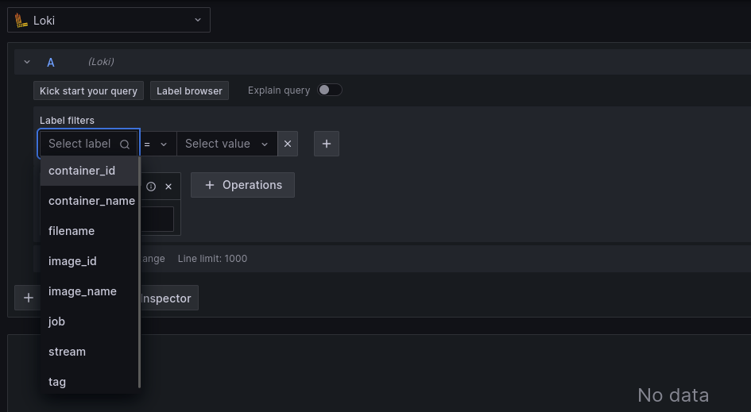
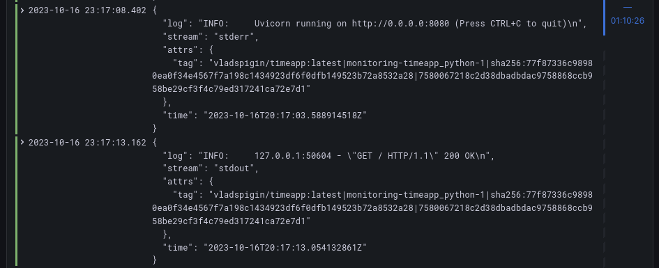
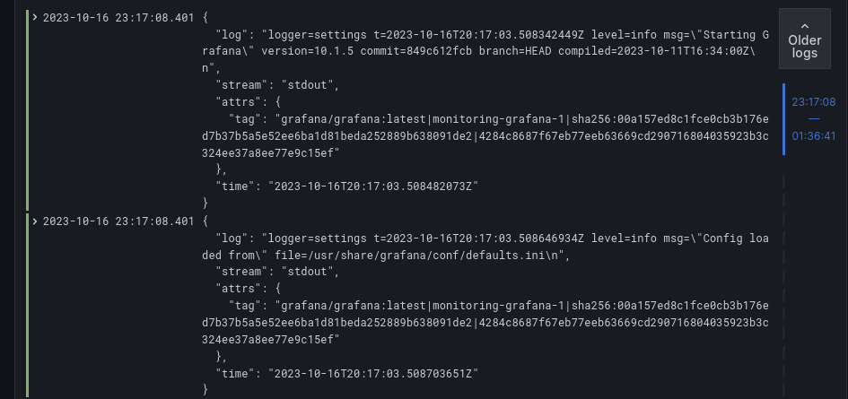

## Logging stack

### Promtail
Used to collect logs from containers and send them to Loki.
Labels are used to extract information about the container from the log tag.
Configuration file: `configs/promtail.yml`

### Loki
Used to store logs from Promtail and provide a query interface.
Loki uses its default configuration file.


### Grafana
Used to query and visualize logs from Loki.
Configuration file: `configs/grafana-datasources.yml`
Promtail, Loki and Grafana are configured to use the same network, so they can communicate with each other by service name.


## Application logs
Both Python and Golang app's logs are sent to stdout and collected by Promtail.
All containers, including logging stack (Grafana, Loki and Promtail), are configured to use the same logging driver, so the same labels are used for all containers.
```yaml
logging: &default-logging
  driver: "json-file"
  options:
    tag: "{{.ImageName}}|{{.Name}}|{{.ImageFullID}}|{{.FullID}}"
```
Here is the examples of queries in Grafana for Golang and Python apps:



Also, logging stack itself is configured to use the same logging driver, so it is possible to query logs from logging stack itself.


#### References
Parts of the docker-compose.yml reused from proposed resources:
https://github.com/grafana/loki/blob/main/production/
https://gist.github.com/ruanbekker/c6fa9bc6882e6f324b4319c5e3622460
